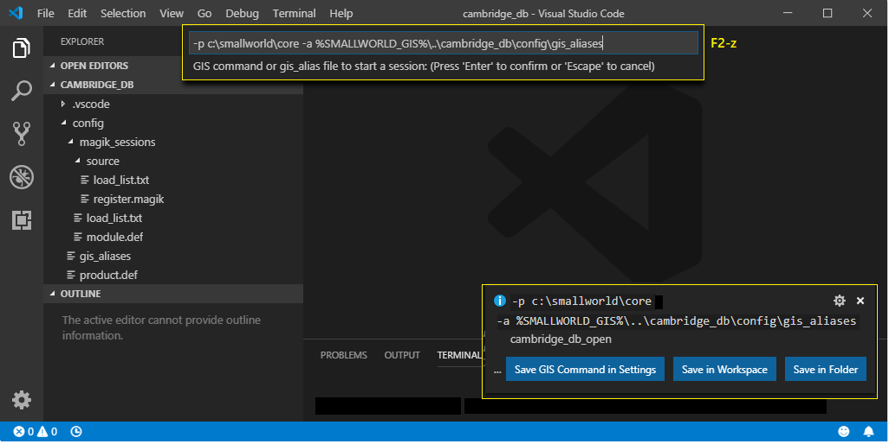
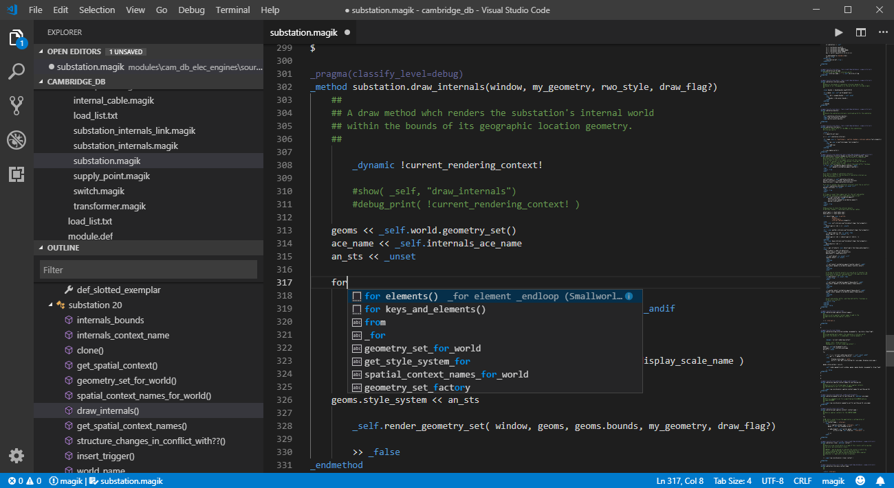
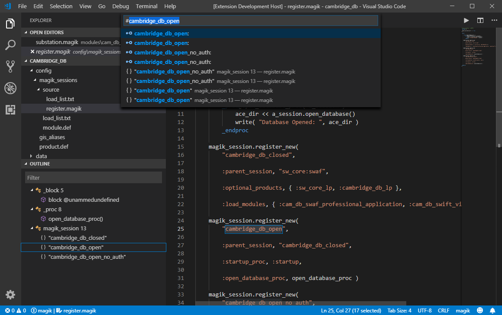
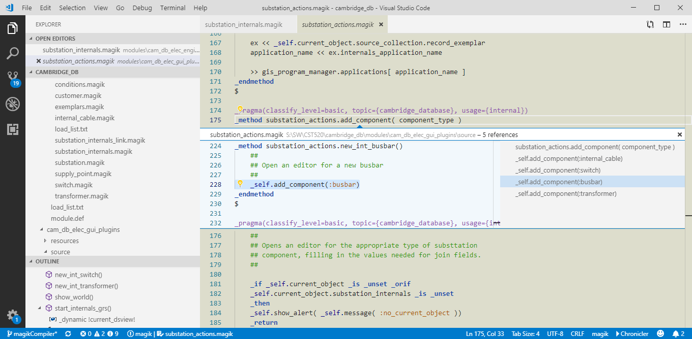
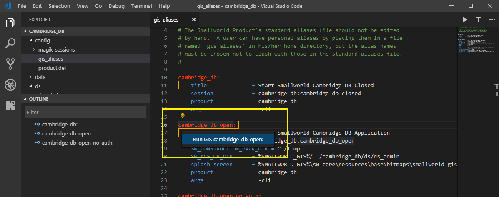

# Integrated Development Environment for Smallworld Magik

This is a fast and modern IDE for [Smallworld](https://en.wikipedia.org/wiki/Smallworld) application development and [Magik](https://en.wikipedia.org/wiki/Magik_%28programming_language%29) programming language.

## Features

* Language support for Magik source and Smallworld resource file types.
* Symbol, Definition and Reference Provider for Magik code and gis_aliases stanzas.
* Smallworld sessions from gis_aliases or GIS Commands. (Contributor: [MarkerDave](https://github.com/MarkerDave) )
* Smallworld 5.x Magik compiler Code Actions, module and product loaders (Not supported on Smallworld 4). 
* Magik traditional light theme and F2-keys shortcut combinations.  

## For Magik Developers

Get started with Smallworld 5.x cambridge_db example, 'C:\Smallworld' installation.  
* Open the cambridge_db product folder in VSCode
* start a session by keyboard shortcut 'F2-z' and enter the following command: 
  -p C:\Smallworld\core -a %SMALLWORLD_GIS%\..\cambridge_db\config\gis_aliases cambridge_db_open

* Optionally save the GIS Command in Settings to the list of GIS Commands preconfigured for 'F2-z'.
* Open a Magik file to see the code outline for classes and methods in the file.
* Add some Magik code to the file and use F2-b to compile the file.

* open the Symbol browser by CTRL-T and see a list of Object Exemplars, Methods, and Procs in the entire product tree, and click to jump to a definition.

* Change the colour Theme to Smallworld Magik to get a traditional Light theme.
* Click on a "Class.Method" combination, hold down CTRL to get Definition Peak or right-click for Definition and References in the context menu  

# Starting a Smallworld sessions 

### Run a GIS Command

* Press 'F2-z' and enter a Smallworld 5 standard format command line _'  [-p productPath] [-e environFile] -a gis_aliasFile alias  '_ to start a session. 

### Run gis_aliases stanzas. (Contributor: [MarkerDave](https://github.com/MarkerDave) )

* Open a gis_aliases file, the stanzas appear boxed in Orange and have Code Actions (Yellow light bulb).
* Click the Light bulb to get the command to Start a Smallworld Session.
* An 'environment.bat' in the same path as gis_aliases will automatically be loaded.

* Set the Smallworld gis.exe path in the Settings and setup optional startup batch commands to run before the gis.exe.
* Open a gis_aliases file, the stanzas appear boxed in Orange and have Code Actions (Yellow light bulb).
* Click the Light bulb to Start a Smallworld Session.
* An 'environment.bat' in the same path as gis_aliases will be loaded automatically.

## Magik Compiler

* Compile Magik code in a Smallworld 5 session, from the Code Actions or using key sequences:
    * 'F2-b' or 'F9' to compile the code buffer in the current editor 
    * 'F2-r' or 'Ctrl+F9' to compile the current code range (e.g. _method ... _endmethod)
    * 'F2-s' or 'Alt+F9' to compile the current code selection
    * 'F2-l' or 'Shift+F9' to compile the current single line of code
    * For F7 compiler keys see "Extension Settings" section below
* Access Class or Method 'apropos' in Hover Actions over 'object.method' definitions.

# Extension Settings

## Smallworld GIS Path ("Smallworld.gisPath")

Open File-Preferences-Settings, expand Extensions - Smallworld GIS and click on "Edit in settings.json". 
Add the "Smallworld.gisPath" entry for Smallworld gis.exe path. Use double backslash '\\' or single forward slash '/'. 
Example:
    "Smallworld.gisPath": "C:/Smallworld/core/bin/x86/gis.exe"

## Smallworld Startup ("Smallworld.startup")

Optionally, "Smallworld.startup" section can be configured in the settings as a JSON array for Windows DOS commands to run before gis.exe. Invalid commands do not stop the startup process.
Example:
    "Smallworld.startup": [
        "set JAVA_HOME=%SMALLWORLD_GIS%/jdk-11.0.1",
        "set PROJECT_DIR=//appserver/SW_Upgrade_5",
        "call %PROJECT_DIR%/set_my_environment.bat",
        "set SW_DB_CONTEXT_DIR=%PROJECT_DIR%/db_context",
        "if not exist %SW_DB_CONTEXT_DIR% mkdir %SW_DB_CONTEXT_DIR%"
    ],

## GIS Command ("Smallworld.gisCommand")
"Smallworld.gisCommand" section contains the configuration for GIS Commands that are executed by F2-z keys and starts a session from a standard Smallworld 5 command line.
A basic GIS Command have the following format:
	"[-p productDir] [-e environFile] -a gis_aliasFile alias"

The advance format for a GIS Command is a JSON object in the following format:
	{	
		"gisPath":  "<Optional Smallworld Core product directory (%SMALLWORLD_GIS%)>"
		"startup":  "<optional DOS commands to run before gis.exe>"
		"command": "<[-p productDir] [-e envFile] [-j options] ... [-a aliasFile] alias ...>"
	}

If "gisPath" and [-p productDir] are not specified, "Smallworld.gisPath" will be used.
If "startup" is not specified, "Smallworld.startup" will be used.
Multiple GIS commands can be saved in the the user settings under "Smallworld.gisCommand" section, and use "Smallworld.gisPath" and "Smallworld.startup" when needed.

The following is an example of a settings.json file for a VSCode Smallworld Magik extension:
{
    "Smallworld.gisPath": "//appserver/Smallworld/CST519/core/bin/x86/gis.exe",
    "Smallworld.startup": [
        "set JAVA_HOME=%SMALLWORLD_GIS%/jdk-11.0.1",
        "set PROJECT_DIR=//appserver/SW_Upgrade_5",
        "call %PROJECT_DIR%/set_my_environment.bat",
        "set SW_DB_CONTEXT_DIR=%PROJECT_DIR%/db_context",
        "if not exist %SW_DB_CONTEXT_DIR% mkdir %SW_DB_CONTEXT_DIR%"
    ],
	"Smallworld.gisCommand": [
		"-p C:/Smallworld/core -a %SMALLWORLD_GIS%/../cambridge_db/config/gis_aliases cambridge_db_open",
		"-a C:/Smallworld/cambridge_db/config/gis_aliases cambridge_db_open",
		{	
			"gisPath":  "C:/SW519/core",
			"startup": [ "set JAVA_HOME=C:/jdk-11.0.1","set PROJECT_DIR="C:/tst/project_1"],
			"command": "-a %PROJECT_DIR%/config/gis_aliases db_open"
		},
		{	
			"gisPath":  "C:/SW520/core",
			"startup":  "set JAVA_HOME=C:/jdk-12.0.2",
			"command": "-a C:/dev/project_1/config/gis_aliases db_open"
		},
		{	
			"gisPath":  "C:/SW518/core",
			"startup":  "set JAVA_HOME=C:/jre",
			"command": "-a C:/prd/project_1/config/gis_aliases db_open"
		}
	]
    "files.autoGuessEncoding": true,
    "terminal.integrated.scrollback": 5000
}

## Compiler F7 Key Combinations
To define F7 key combinations for the Magik compiler:

- Open Preferences Keyboard Shortcuts (Ctrl-K Ctrl-S)
- Type "SW Compile Magik" in the filter to find the Magik compiler commands
- Select the commands you want to change (for example F9 keys) and edit to F7 

# Release Notes

## [1.4.0] - 2019-08-04

* New GIS Command (F2-z) to start a session. 
* Multi-environment configuration for GIS path, command and startup.
* Support for Case and Style archive files.
* Various bug fixes and improvements. 

## Known Issues 

### Limited Support for Smallworld Older Versions
There are some limitations for Smallworld versions older than 5.0: 

* GIS Command syntax does not fully support Smallword 3.x and 4.x 
* Smallworld 3.x and 4.x sessions are not integrated Terminals
* Magik Compiler commands do not support Smallworld 3.x and 4.x

### Workspace Close\Open Terminates the Session.
Opening/closing a Workspace or the active Folder while a Smallworld Session is running, will terminate the session without a warnings.

**Workarounds:** 
* Use 'Add Folder to Workspace...' to access the sourece tree
* Quit the Smallworld Session before switching the active Folder or Workspace.

